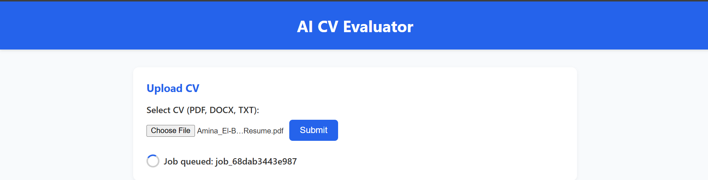
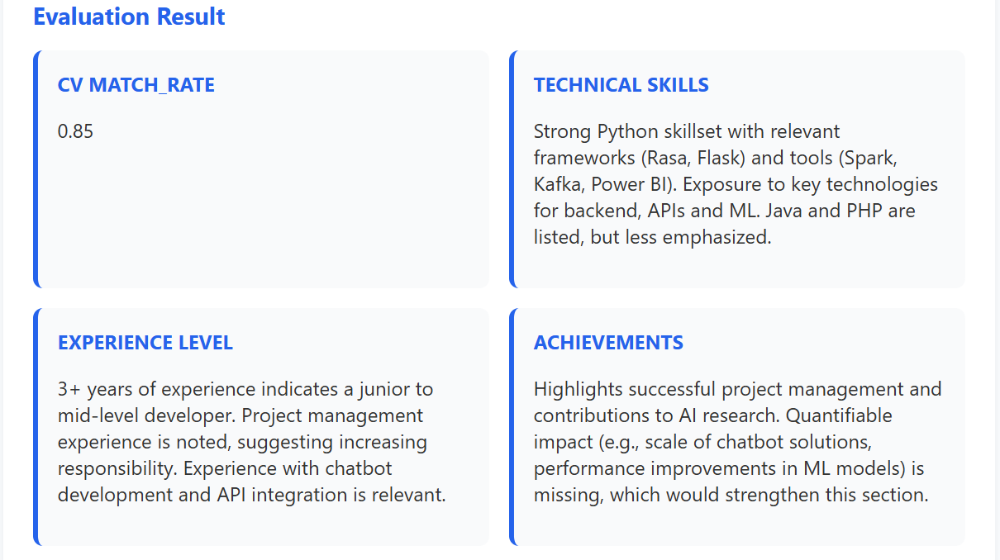
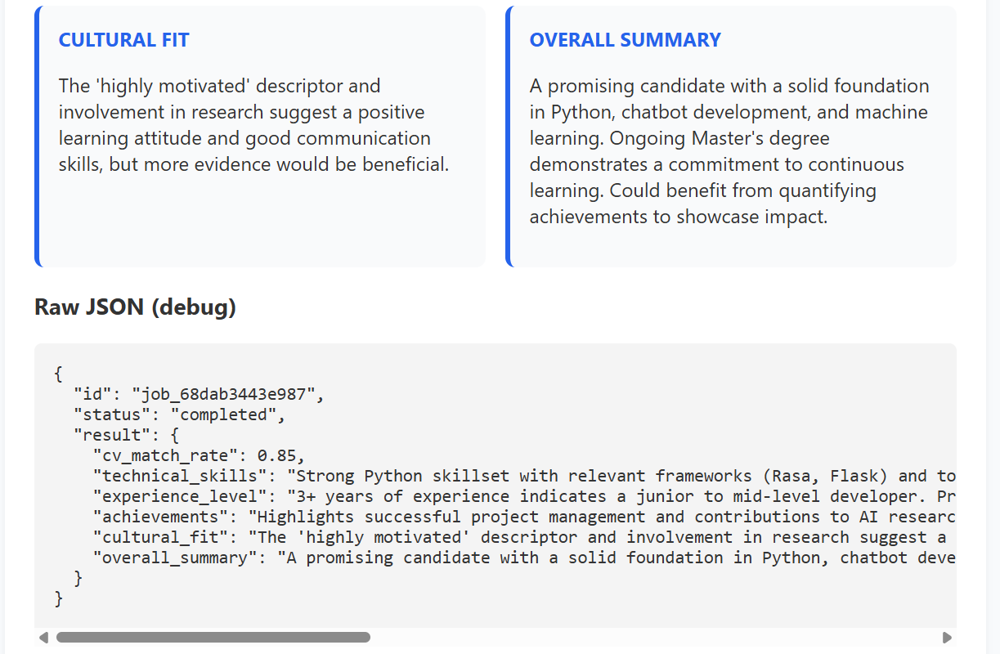

# 🧠 AI CV Evaluator

AI-powered CV evaluation system built with **PHP, MySQL, and OpenAI API**.  
This project helps HR teams or recruiters to **analyze candidates’ resumes automatically** and generate structured insights.

---

## ✨ Features
- 📤 Upload CV (PDF, DOCX, TXT)  
- 🔎 Extracts text using [Smalot PDF Parser](https://github.com/smalot/pdfparser)  
- 🤖 AI-powered evaluation (via LLM) based on criteria:
  - Technical Skills Match  
  - Experience Level  
  - Achievements  
  - Cultural Fit  
- 📊 Results stored in database + downloadable as `.txt`  
- 💻 Clean web interface with real-time status updates and evaluation cards  

---

## 🚀 Tech Stack
- **Backend**: PHP (cURL, MySQLi)  
- **Database**: MySQL  
- **AI API**: OpenAI-compatible LLM  
- **Frontend**: HTML, CSS, Vanilla JS  
- **Parsing Library**: Smalot\PdfParser  

---

## 📸 Demo Screenshots  

## Upload Form  
  
  

### Evaluation Result  
  
  

### Status Updates  
  
  


---

## ⚙️ Installation
1. Clone repo:
   ```bash
   git clone https://github.com/hafiz1512/ai-cv-evaluator.git

